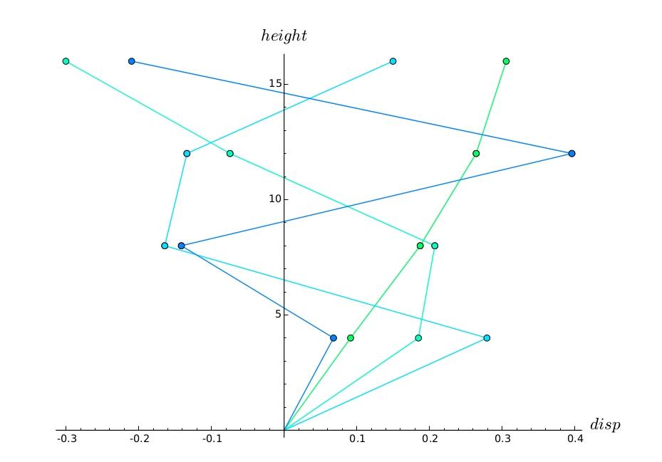
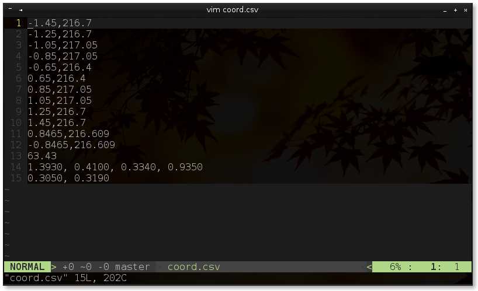
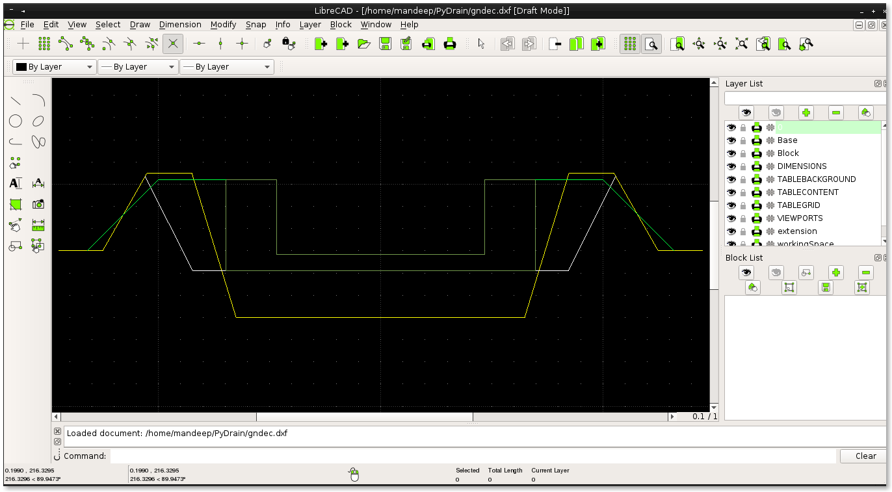

:title: Mandeep Singh 
:data-transition-duration: 1500
:css: hovercraft.css

*6-month Training Presentation*
===================================

Mandeep Singh

1243667

----

*Introduction to DoS*
=====================
 

Dynamics of Structures (DoS) is an open-source, free web-based software, developed under the guidance of Dr. H.S. Rai. 

----

It can be used to compute:

* Modes of vibration in which the structure can move 
* Force applied on each floor due to the vibration caused by the earthquake. 
 
----

Hence the Civil Engineers can analyze
the stability of structure consisting of many stories.

----

*Basic concept of what it does*
===============================

----

Structural analysis is mainly concerned with finding out the behavior of a physical structure when subjected to force. 

----

.. ----

.. Requirements
.. ============
.. 1. Provide on-line way to analysis so that individual does not have to install anything.
.. 2. Send PDF to the user in the form of email.
.. 3. Make it work like batch mode. so, that user can give inputs together and relax.
.. 4. Accept inputs from the user in *.csv file format
.. 5. Help M.Tech and Civil Engineer to analysis structure.
.. 6. Automatic calculation of modal force and modes.
.. 7. Reduce the time for analysis.
.. 8. Generates the final output in the form of pdf

----

*Technologies Used*
===================

----

*SageMath*
===========

SageMath is mathematical software with features covering many aspects of mathematics, including algebra,
combinatorics, numerical mathematics, number theory, and calculus.

----

*Django* 
=========

Django is an open source web application framework written in python. It lets you build high-
performing, elegant Web applications quickly. 

----

*LaTeX*
=========

LaTeX is a preparation system for the TeX typesetting program.

----

*Doxygen*
============

Doxygen is a documentation generator, a tool for writing software reference documentation.

----

*Git*
========

Git is a distributed revision control and source code management (SCM) system. 

----

:data-y: r-1000

*Implementation*
===================

Development of DoS started with development in phases which focus on particular need of project.
Various phases and their detail are given below as follows. 

----

:data-y: r0

• Phase I (Sagemath)

.. During Phase I, we wrote code in Sagemath to compute all the required output variable.
.. We used two files for this.Input variable are written in input.sage and main.sage loads this
.. variable and compute all desired inputs.

----

• Phase II (LaTeX)

.. During phase II, we embedded sage modules into LaTeX by loading them into civil.tex and
.. then displayed these variables in output PDF and all this work is done by sagetex.sty. To
.. execute all this commands on one go we wrote script civil.sh.

----

• Phase III (Django)

.. During phase III, we provided web interface to this software using Django. Djano was used
.. to get input from user and write input.sage file for particular user then civil.sh is called by
.. passing name of user directory to it and then get output PDF.

----

• Phase IV (Improvements)

.. During phase IV, we improved the code structure and added additional functionality like
.. sending PDF as email and accepting input as CSV file. Finally, the UI was improved and
.. made responsive.

----

• Phase V (Testing)

.. During phase V, we tested the software for various conditions and then applied required
.. error control and messaging mechanism. initialfile.py file was created to save software from
.. problem of server restart which can causes processing user request to stop. so, that the
.. interrupted request of user can be restart and send PDF.

----

• Phase VI (Documentation)

.. During final phase, we documented the project( developers documentation and README.md)
.. using doxygen and wrote the report for this software. 

----

*Link to DoS:*
==================

http://lab.gdy.club:8088/

----

*Documentation* 
================

http://lab.gdy.club/~amarjeet/DEV_Documentation/html

----

:data-y: r1000

*PyDrain*
============

----

:data-y: r0

A web-based as well as Command-line utility that can be used to create drawings in DXF format using CSV input and it calculates the area of different parts of the drawing.

----

:data-rotate: 90

----

:data-x: r0
:data-y: r750
:data-scale: 0.1

----

:id: ThreeD
:data-y: r1200
:data-rotate-x: 180

*Fork and contribute!*

https://github.com/mandeeps708

----

*Thank you...*

